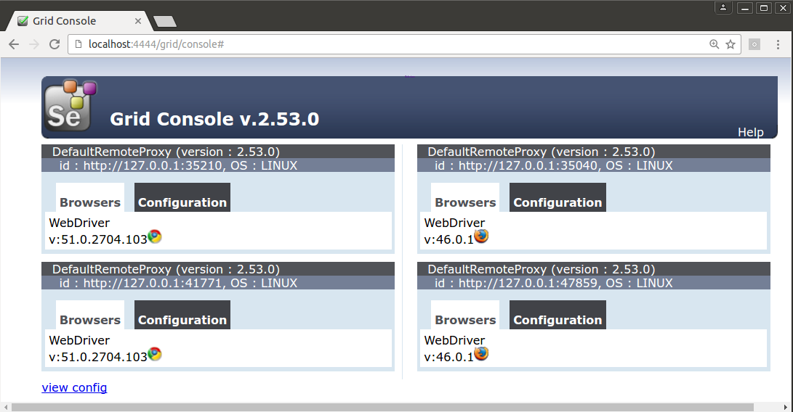
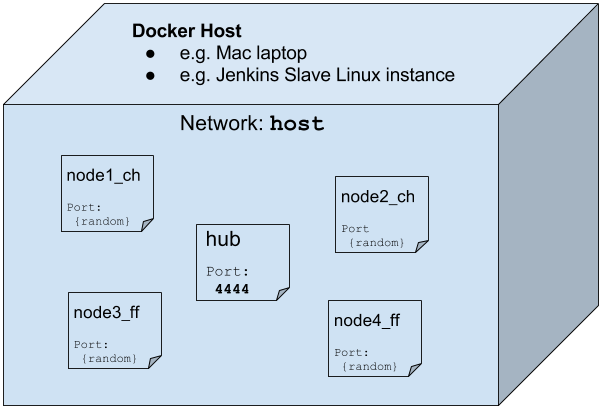

## Grid
The preferred way now is to use [docker-compose](./docker-compose.md) or keep reading if you don't want to use docker-compose.

For even morealternatives see [hub_and_nodes_alternatives](./hub_and_nodes_alternatives.md)

## Hub
Let's setup a grid and all the nodes on the same IP address than the host machine.

Flags `-e CHROME=false -e FIREFOX=false` turn the container into a grid-only one.

    docker run -d --name=hub --net=host \
      -e GRID=true -e CHROME=false -e FIREFOX=false \
      -e VNC_START=false -e PICK_ALL_RANDMON_PORTS=true \
      -e SELENIUM_HUB_PORT=4444 \
      elgalu/selenium

    docker exec hub wait_all_done 30s

This is how it should look like so far:

## Nodes
Let's add some nodes

### Chrome
Chrome will also attach to the `host` network interface.

    docker run -d --name=node1_ch --net=host \
      -e GRID=false -e CHROME=true -e FIREFOX=false \
      -e VNC_START=false -e PICK_ALL_RANDMON_PORTS=true \
      -e SELENIUM_HUB_PORT=4444 \
      -v /dev/shm:/dev/shm \
      elgalu/selenium

    docker run -d --name=node2_ch --net=host \
      -e GRID=false -e CHROME=true -e FIREFOX=false \
      -e VNC_START=false -e PICK_ALL_RANDMON_PORTS=true \
      -e SELENIUM_HUB_PORT=4444 \
      -v /dev/shm:/dev/shm \
      elgalu/selenium

### Firefox
Firefox will also attach to the host machine network interface.

    docker run -d --name=node3_ff --net=host \
      -e GRID=false -e CHROME=false -e FIREFOX=true \
      -e VNC_START=false -e PICK_ALL_RANDMON_PORTS=true \
      -e SELENIUM_HUB_PORT=4444 \
      -v /dev/shm:/dev/shm \
      elgalu/selenium

    docker run -d --name=node4_ff --net=host \
      -e GRID=false -e CHROME=false -e FIREFOX=true \
      -e VNC_START=false -e PICK_ALL_RANDMON_PORTS=true \
      -e SELENIUM_HUB_PORT=4444 \
      -v /dev/shm:/dev/shm \
      elgalu/selenium

### Wait
Is convenient to wait for all the nodes to start correctly, also to catch errors before starting the tests in vane:

      docker exec node1_ch wait_all_done 30s
      docker exec node2_ch wait_all_done 30s
      docker exec node3_ff wait_all_done 30s
      docker exec node4_ff wait_all_done 30s

### Finally

This is the final sample grid

#### Diagram
This is the docker diagram of that grid

### Cleanup

    docker rm -vf hub node1_ch node2_ch node3_ff node4_ff || true
